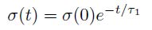
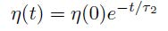
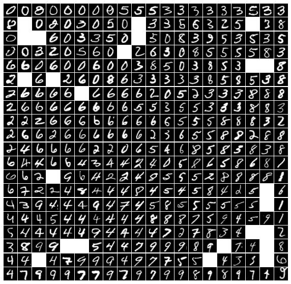
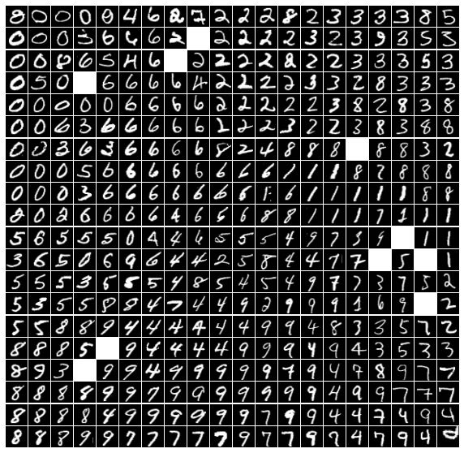
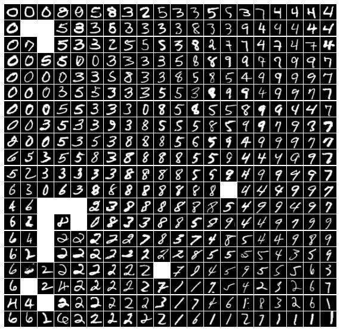

# Kohonen Self-Organizing Maps (SOM) for MNIST Dataset

In the notebook, a Kohonen (SOM) is implemented and applied on 5000 samples of MNIST dataset. The algorithm is applied in 25 minibatches of size 200.

# Dataset

MNIST is dataset of handwritten digits. 500 samples of each digit is randomly chosen, creating a dataset of size 5000.

# Implementation and Training

Essential processes of a SOM are:

1. Initialization
2. Competition
3. Cooperation
4. Synaptic Adaptation

## 1. Initialization

Each weight is randomly assigned by numpy.random.

## 2.Competition

Closest neurons for each input is found by calculating the euclidean distance, and deemed as winners.

## 3. Cooperation

Neighbors of each winner is determined by calculating the gaussian function. σ is the neighborhood radius.

## 4. Synaptic Adaptation

Neurons weights are updated using the hebb rule.

## Radius decay

Radius is updated after each epoch using the following formula:

t is the time constant.

## Learning rate decay

Learning rate is updated after each epoch using the following formula:

t is the time constant.

# Results

Size of all SOMs is 20x20.

<table class="tg">
<thead>
  <tr>
    <th class="tg-0pky">Version</th>
    <th class="tg-0lax">Initial Learning Rate</th>
    <th class="tg-0lax">Initial Radius</th>
    <th class="tg-0lax">LR decay</th>
    <th class="tg-0lax">Radius decay</th>
    <th class="tg-0lax">Final map</th>
  </tr>
</thead>
<tbody>
  <tr>
    <td class="tg-0lax">1</td>
    <td class="tg-0lax">0.01</td>
    <td class="tg-0lax">5</td>
    <td class="tg-0lax">None</td>
    <td class="tg-0lax">None</td>
    <td class="tg-0lax"></td>
  </tr>
  <tr>
    <td class="tg-0lax">2</td>
    <td class="tg-0lax">0.5</td>
    <td class="tg-0lax">3</td>
    <td class="tg-0lax">t = 80</td>
    <td class="tg-0lax">None</td>
    <td class="tg-0lax"></td>
  </tr>
  <tr>
    <td class="tg-0lax">3</td>
    <td class="tg-0lax">10</td>
    <td class="tg-0lax">3</td>
    <td class="tg-0lax">t = 80</td>
    <td class="tg-0lax">t = 120</td>
    <td class="tg-0lax"></td>
  </tr>
</tbody>
</table>
